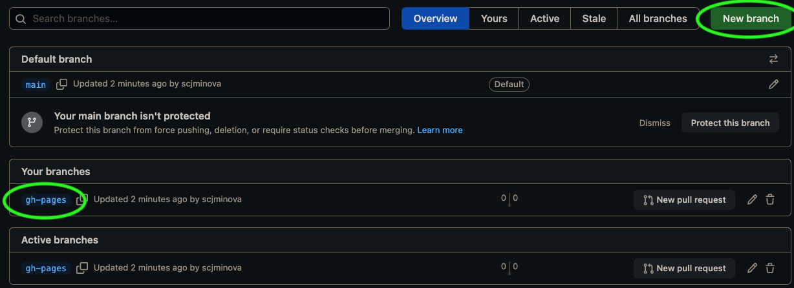
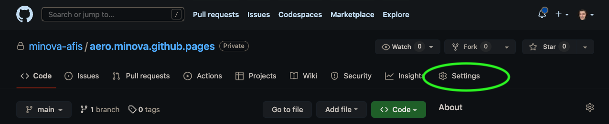
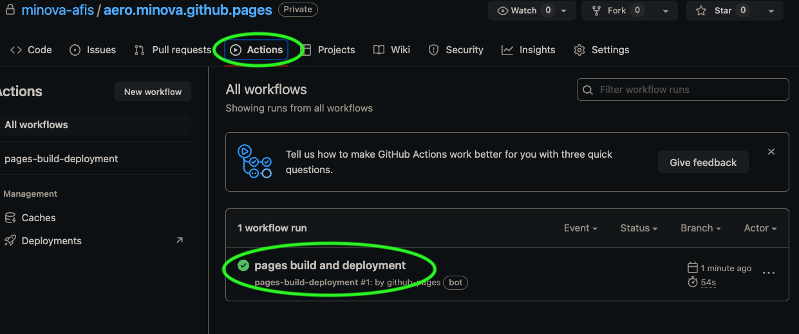
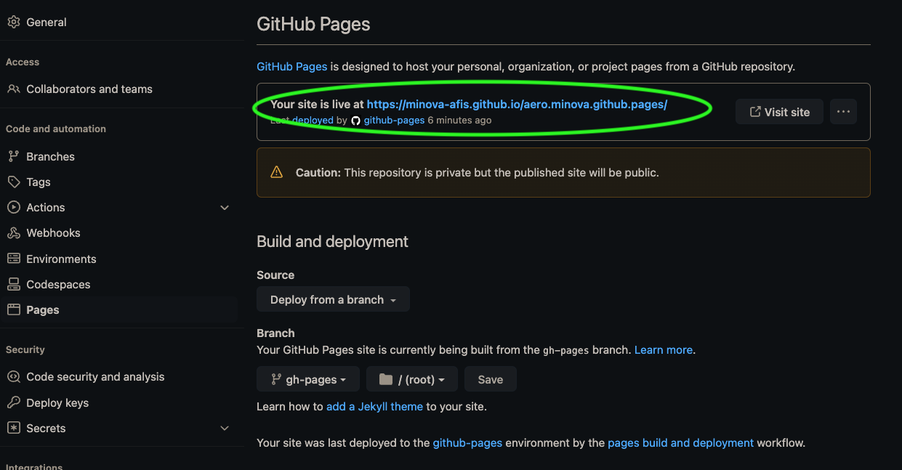

## Konfiguration

## Konfiguration des Standards

1. Zuerst begibt man sich auf die Startseite des Repositories, das mit einer GitHub Page versehen werden soll.

   

2. Es empfiehlt sich, die Dateien für die GitHub Page auf einen separaten Branch auszulagern. Hierzu klickt man auf das Fork-Symbol mit der Anzahl der Branches.

   

3. In der Ansicht für die Branches erstellen wir per Klick auf den Button **New branch** einen neuen und nennen diesen **gh-pages**.

   

4. Zurück in der Hauptübersicht des Repositories klicken wir nun auf **Settings**.

   

5. In den Settings klicken wir auf **Pages**.

   

6. Hier wählen wir unter dem Oberpunkt **Branch** den eben erstellten Branch **gh-pages** aus. Das Verzeichnis belassen wir beim Standard **/root** und klicken auf **Save**.

   

7. Um zu überprüfen, ob die Konfiguration geklappt hat, können wir auf den Reiter **Actions** klicken. Dort wird ein Workflow angestoßen, der **pages build and deployment** heisst. Dieser Workflow benötigt ungefähr eine Minute und wird mit einem grünen runden Hakensymbol vesehen, sowie er erfolgreich abgeschlossen wurde.

   

8. Zurück in der **Settings/Pages**-Ansicht finden wir nun oben den Link zu unserer frisch deployten GitHub Page. Der Zeitraum zwischen ausgeführtem Workflow und der tatsächlichen Erreichbarkeit der GitHub Page kann durchaus einige Minuten bis zur Aktualisierung dauern.

   
